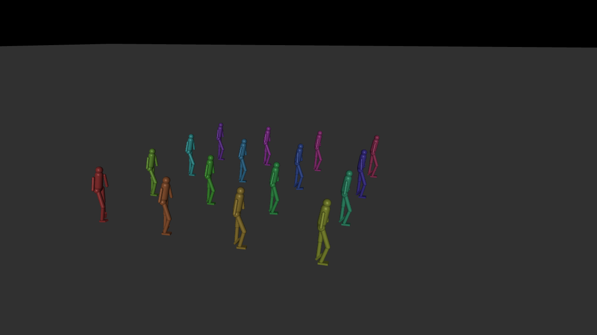

# GPU MuJoCo physics — the MJX training path

This is the **"real MuJoCo on the GPU"** path. It uses [MJX](https://mujoco.readthedocs.io/en/stable/mjx.html),
MuJoCo's official JAX/XLA reimplementation, so the *physics solver itself* runs on
the GPU — not just the RL update. The entire loop is GPU-resident:

| Stage | Device |
|---|---|
| Physics (`mjx.step`, MuJoCo on XLA) | **GPU** |
| Policy inference (JAX MLP) | **GPU** |
| PPO update (GAE + clipped surrogate + Adam) | **GPU** |

It trains the same 16-DoF humanoid ([`../assets/humanoid16.xml`](../assets/humanoid16.xml))
as the rest of the repo to walk.

> **This is a separate stack from the Windows DX12 editor.** The C++/DX12 engine
> (`src/`, `editor/`) uses the CPU MuJoCo C API for physics and custom HLSL for the
> RL update. MJX requires JAX, which only does GPU on **Linux or WSL2 + CUDA** —
> *not* native Windows. The two paths share only the MJCF humanoid asset.

## Setup (WSL2 / Linux, NVIDIA GPU)

```bash
# Inside WSL2 Ubuntu (or native Linux) with an NVIDIA driver visible to the GPU:
python3 -m venv ~/mjxenv
~/mjxenv/bin/pip install -U pip
~/mjxenv/bin/pip install -r mjx/requirements.txt

# sanity check — should print a CudaDevice and "gpu"
~/mjxenv/bin/python -c "import jax; print(jax.default_backend(), jax.devices())"
```

## Train

```bash
cd /path/to/AISTANK
~/mjxenv/bin/python mjx/train_humanoid.py --envs 2048 --updates 200 --save mjx/policy.pkl
```

Output (verified on an RTX 5080 in WSL2):

```
JAX backend: gpu  devices: [CudaDevice(id=0)]
compiled in 38.7s; obs_dim=59 act=16
update    0 | mean_reward   0.448 | ...
update   20 | mean_reward   0.753 | ...
update   40 | mean_reward   1.207 | ...
update   50 | mean_reward   1.231 | ...
```

Rising mean reward = the humanoid is learning to stay upright and move forward.
Walking gaits need longer runs (thousands of updates); this scaffold establishes
the correct, fully-GPU pipeline.

## Watch a crowd train together — `train_arena.py`

Builds **one MuJoCo world holding N humanoids that don't collide with each other**
(collision-filtered via `contype`/`conaffinity`), each a **distinct color**, and
trains them all at once on the GPU. Each humanoid is its own RL agent sharing one
policy; with per-agent exploration and resets they diverge, so you watch a whole
color-coded crowd learn. For throughput it also vmaps `E` copies of the arena
(`E·N` agents on the GPU); arena 0 is rendered to a video.

```bash
~/mjxenv/bin/python mjx/train_arena.py --agents 16 --arenas 32 \
    --updates 300 --render mjx/arena.gif
```

Everything that is *training* runs on the GPU — physics (`mjx.step`), inference,
GAE, and the PPO/Adam update are all jitted onto XLA. The render is offscreen
(EGL) and writes `arena.gif` plus a still frame:



*16 individually-colored humanoids in one arena, driven by the GPU-trained policy
(reward rose 0.45 → 1.12 over 40 updates in this short run). They pass through one
another — no inter-agent collision.*

`arena.py` alone (`python mjx/arena.py 16`) just builds the world and renders a
standing preview, useful for checking colors/layout.

## Train overnight — `train_overnight.py`

The production trainer, built to run unattended for hours and actually converge
to a walking gait:

- **Observation normalization** (running mean/std) — the ingredient that makes
  PPO learn to *walk* rather than just balance.
- **Checkpointing + `--resume`** — atomic checkpoint every `--save-every`
  updates; resume exactly where it left off. Ctrl-C saves before exiting.
- **Logging** to `mjx/runs/<timestamp>/train.log` (and `runs/latest`).
- **Render snapshots** every `--render-every` updates so you can watch it improve.
- Trains thousands of **independent single-humanoid envs** (fast — small per-env
  constraint system) and renders the learned per-humanoid policy on a colored
  **crowd**, so you get both speed and the nice visual.

```bash
cd /mnt/c/Users/adria/Desktop/AISTANK

# launch detached; ~hundreds of millions of env-steps overnight on an RTX 5080
MUJOCO_GL=egl nohup ~/mjxenv/bin/python mjx/train_overnight.py \
    --envs 4096 --updates 20000 --resume > /dev/null 2>&1 &

tail -f mjx/runs/latest/train.log          # watch progress / snapshots

# in the morning: replay the trained crowd to a gif
~/mjxenv/bin/python mjx/train_overnight.py --play mjx/checkpoints/walk.pkl
```

Resuming is automatic with `--resume`: re-running the same command continues
from `mjx/checkpoints/walk.pkl`. Reward rises within the first ~30 updates
(verified: 0.46 → 1.27 in 50 updates, crowd standing/balancing upright); a
walking gait emerges over a long run.

## 2v2 soccer (two-phase: imitation → self-play)

A full GPU pipeline for 2v2 soccer with a physically realistic ball.

**Scene** ([`soccer_scene.py`](soccer_scene.py)): pitch, two goals, four
team-colored humanoids (2 blue vs 2 red), and a free-body ball.

**Ball physics** ([`soccer_env.py`](soccer_env.py)): on top of MuJoCo contact we
apply, each substep, a **Magnus force** (`K·ω×v`) so spin curves the flight, plus
quadratic **drag**. Verified — a sidespin kick travels 6.6 m and bends 0.93 m.

**Phase 1 — imitation/locomotion** ([`imitation.py`](imitation.py)): learn to walk
*forward* by tracking a procedural reference gait (DeepMimic-style; no mocap
exists for this body) **plus** a heading-aware reward (velocity along the torso's
facing axis), which removes the side-stepping artifact. Phase-free, 59-dim obs.

```bash
MUJOCO_GL=egl ~/mjxenv/bin/python mjx/imitation.py --envs 4096 --hours 6 --resume
# -> mjx/checkpoints/walk_fwd.pkl
```

**Phase 2 — self-play soccer** ([`train_soccer.py`](train_soccer.py)): all four
players share one policy (symmetric self-play), **warm-started** from the Phase-1
walker (the 59-dim locomotion input block + hidden/output layers are copied; the
18 soccer-context inputs start at zero). Reward: upright + get to ball + drive
ball to the opponent goal + score.

```bash
MUJOCO_GL=egl ~/mjxenv/bin/python mjx/train_soccer.py \
    --init mjx/checkpoints/walk_fwd.pkl --envs 1024 --hours 10 --resume
MUJOCO_GL=egl ~/mjxenv/bin/python mjx/train_soccer.py --play mjx/checkpoints/soccer.pkl
```

**Honest scope:** the whole pipeline is verified to *run and learn* (scene
renders, ball curves, both phases train and checkpoint, warm-start transfers).
A genuinely *skilled* 2v2 team that passes and combines is a large-compute
research problem (cf. DeepMind MuJoCo soccer, Google Research Football) — this
provides the correct architecture and long-training entry points, not a finished
team. Expect Phase 1 to need a few hours for a clean gait, and Phase 2 much
longer (and likely reward-shaping iteration) for real soccer behavior.

## Notes

- First call pays a one-time XLA compilation cost (~30–60 s) for the whole
  rollout+update graph; subsequent updates are fast.
- The reward, observation layout, and termination conditions mirror the DX12
  engine's `CS_RewardAndTerminate` so the two implementations are comparable.
- `--save` writes the policy (a pickled JAX pytree) for later evaluation/rendering.
